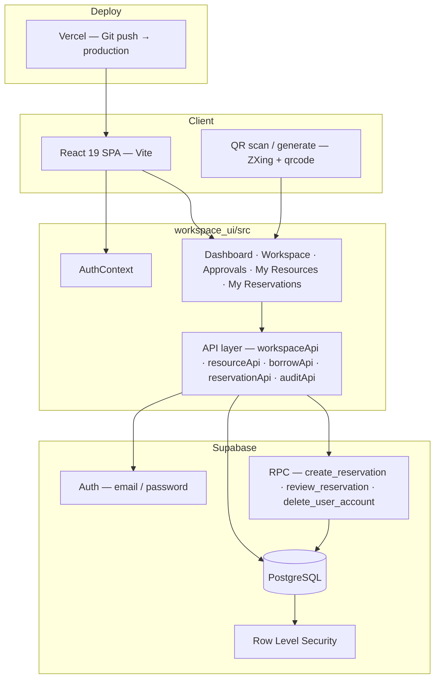

# Campus Spaces

**Campus Spaces** is a university workspace platform for reserving rooms and labs, borrowing shared equipment, and governing access across departments. It replaces spreadsheet tracking with a single system of record: who booked what space, who checked out what gear, and who approved each action.

Deployed on **Vercel** with **Supabase** as the backend. Built as a freelance delivery for a small school, extended for campus-scale use (departments, room types, time-slot booking, multi-approver workflows).

---

## Architecture

The app is a **React SPA** that talks directly to Supabase (Auth + Postgres + RLS + RPC). Business rules for reservations live in Postgres functions; the client handles UI, role gating, and orchestration.



### Why Supabase instead of a custom API server?

Campus operations map cleanly to **relational data** (workspaces, memberships, borrow requests, reservations) with a small set of **server-side invariants** (booking overlap, approval chains). Supabase provides auth, Postgres, RLS, and RPC in one managed layer, so the product ships without operating a separate Node/Java API tier.

The tradeoff is real: complex authorization is split between RLS policies and client-side role checks. That is acceptable here because the domain is bounded (workspaces, borrows, reservations) and critical booking rules are enforced in Postgres (`EXCLUDE` constraint + `create_reservation` RPC), not only in the browser.

### Project layout

```
Workspace Management/
├── workspace_ui/                    # Production app
│   ├── src/
│   │   ├── api/                     # Supabase client modules (no separate REST server)
│   │   │   ├── workspaceApi.ts      # Workspaces, membership, invites, roles
│   │   │   ├── resourceApi.ts       # Equipment CRUD + workspace linking
│   │   │   ├── borrowApi.ts         # Checkout, multi-approver, returns
│   │   │   ├── reservationApi.ts    # Room/lab time-slot booking
│   │   │   ├── departmentApi.ts     # Department catalog
│   │   │   ├── auditApi.ts          # Per-workspace activity log
│   │   │   └── userApi.ts           # Account deletion RPC
│   │   ├── contexts/AuthContext.tsx # Session + global role
│   │   ├── pages/                   # Route-level views
│   │   ├── components/              # Layout, modals, reservation panel
│   │   └── types/                   # Shared TypeScript contracts
│   └── supabase/                    # SQL migrations (run in Supabase dashboard)
│       ├── university_upgrade.sql   # Departments, workspace types, reservations
│       └── add_departments.sql      # Incremental department seeds
└── src/                             # Legacy smoke-test scripts (testers.ts)
```

### Design decisions

| Concern | Approach |
|--------|----------|
| **Workspace types** | `ROOM` and `LAB` support time-slot reservations; `EQUIPMENT` pools use borrow/checkout only. Labs can do both. |
| **Departments** | `departments` table scopes discovery and filtering (CS, Engineering, Library, etc.). |
| **Reservations** | `tstzrange` + GiST `EXCLUDE` prevents overlapping confirmed/pending bookings per workspace. |
| **Equipment borrow** | Multi-approver chain via `borrow_request` + `approvals`; `reqApprovers = 0` auto-approves. |
| **Permissions** | Two layers: global `users.role` (`MASTER`, `ADMIN`) and per-workspace `workspace_users.role` (`MEMBER` → `OWNER`). |
| **Audit vs borrow history** | **Audit log** = narrative activity per workspace. **Accountability history** on Approvals = structured borrow records + CSV export. Kept separate on purpose. |
| **QR workflow** | Each resource gets a printable QR pointing to `/resource/:id` for scan-to-borrow in the field. |
| **Deploy** | Vercel hosts the static SPA; Supabase holds data and auth. Push to GitHub triggers production deploy. |

### Tech stack

- **Frontend:** React 19, TypeScript, Vite 6, Tailwind CSS 4, React Router 7, Motion
- **Backend:** Supabase (Auth, PostgreSQL, RLS, RPC)
- **Integrations:** ZXing (camera QR scan), qrcode (label generation)
- **Deploy:** Vercel (frontend), Supabase Cloud (database)

---

## Features

| Area | What it does |
|------|----------------|
| **Dashboard** | Browse and filter workspaces by type and department; request to join; create rooms, labs, or equipment pools. |
| **Reservations** | Book room/lab time slots with conflict detection; optional approver sign-off; cancel from **My Reservations**. |
| **Equipment** | Request borrow → multi-approver workflow → return with optional note; status tracked per item. |
| **Approvals** | Approvers review pending reservations and borrow requests; borrow history table with CSV export. |
| **Membership** | Join requests, email invites, role changes, ownership transfer, leave-workspace guards. |
| **Audit log** | Per-workspace activity stream (membership, resources, borrows, reservations). |
| **Auth** | Sign up, login, password reset; protected routes with deep-link preservation (e.g. scanned QR URLs). |

---

## Data model (PostgreSQL)

```
departments ──► workspaces ◄── workspace_users ──► users (profile)
                    │
                    ├── workspace_resource ──► resource
                    │                              └── borrow_request ──► approvals
                    ├── reservations (room/lab time slots)
                    └── audit_logs

user_feedback (optional; admin-only read)
```

**Key RPCs:** `create_reservation`, `review_reservation`, `has_reservation_conflict`, `delete_user_account`

Schema migrations live in [`workspace_ui/supabase/`](workspace_ui/supabase/). See [`workspace_ui/supabase/README.md`](workspace_ui/supabase/README.md) for run order and backup notes.

---

## Prerequisites

- **Node.js** 18+
- **npm**
- **Supabase** project (URL + anon key)
- **Vercel** account (optional, for deploy)

---

## Local setup

### 1. Install and configure

```bash
cd workspace_ui
npm install
```

Create `workspace_ui/.env.local`:

```env
VITE_SUPABASE_URL=https://your-project.supabase.co
VITE_SUPABASE_PUBLISHABLE_DEFAULT_KEY=your-anon-key
```

Optional (QR labels use the public app URL when set):

```env
VITE_PUBLIC_APP_ORIGIN=https://your-app.vercel.app
```

### 2. Database migrations

In **Supabase Dashboard → SQL Editor**, run:

1. `workspace_ui/supabase/university_upgrade.sql` (required for departments, reservations, workspace types)
2. `workspace_ui/supabase/add_departments.sql` (if you already ran the upgrade and only need more departments)

### 3. Run

```bash
npm run dev
```

App: **http://localhost:3000**

```bash
npm run build   # production bundle
npm run lint    # TypeScript check
```

---

## Deployment

1. Connect the GitHub repo to **Vercel** (root directory: `workspace_ui` if monorepo).
2. Set the same `VITE_*` env vars in the Vercel project settings.
3. Push to your production branch — Vercel builds and deploys automatically.

Supabase env vars do not need to live on Vercel beyond the public URL and anon key (standard Supabase SPA pattern).

---

## API surface (client modules)

There is no standalone REST server. The UI calls Supabase tables and RPCs through typed modules:

| Module | Responsibility |
|--------|----------------|
| `workspaceApi` | CRUD workspaces, membership, invites, role changes, access checks |
| `resourceApi` | Equipment CRUD, workspace linking, status updates |
| `borrowApi` | Borrow requests, multi-approver votes, returns, history |
| `reservationApi` | List/create/cancel reservations; approver review via RPC |
| `departmentApi` | List/create departments |
| `auditApi` | Append and fetch per-workspace activity logs |

---

## Resume highlights

- End-to-end ownership: requirements with a non-technical client, schema design, UI, Supabase migrations, Vercel deploy, and handoff.
- **Concurrency-safe booking** via Postgres exclusion constraints and security-definer RPCs.
- **Multi-approver equipment workflow** with configurable approval count per resource.
- **Role-based access** across global and workspace scopes without a custom auth server.
- **Operational visibility**: audit logs for workspace activity + exportable borrow accountability history.
